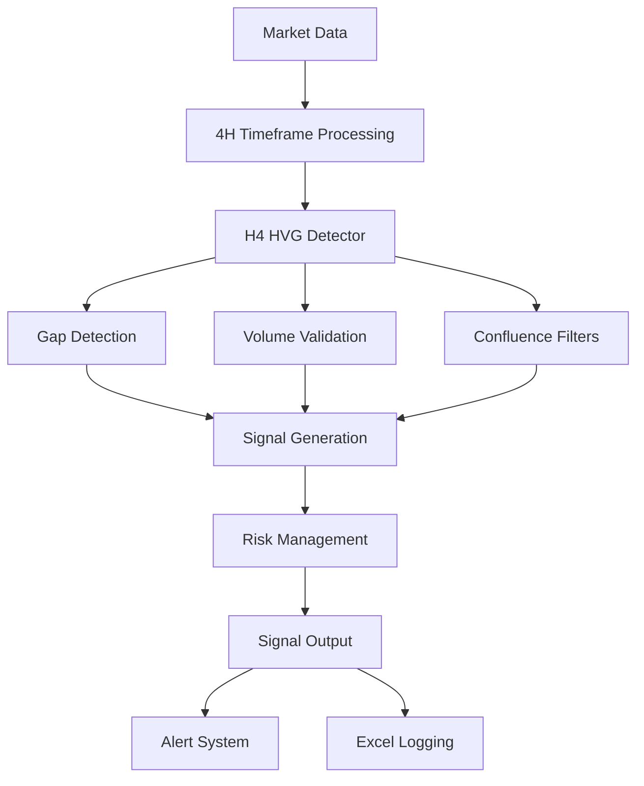

# Design Document

## Overview

The H4 HVG (4-Hour High Volume Gap) strategy is designed to identify institutional trading opportunities by detecting significant price gaps on the 4-hour timeframe that are accompanied by volume spikes. This strategy will be integrated into all six existing scanners as an additional signal detection method, working alongside the current EMA crossover and trend-following strategies.

The strategy focuses on capturing momentum moves that occur when institutional traders create gaps in price action, typically indicating strong directional bias and potential continuation patterns.

## Architecture

### High-Level Architecture



### Integration Architecture

The H4 HVG strategy will be integrated into the existing scanner architecture through:

1. **Extension of SignalDetector**: Add H4 HVG detection as a new method in the base SignalDetector class
2. **Specialized Detectors**: Enhance Gold and US30 specific detectors with H4 HVG capabilities
3. **Configuration Integration**: Add H4 HVG parameters to existing configuration files
4. **Timeframe Management**: Ensure 4-hour data is available in all scanners

## Components and Interfaces

### 1. H4HVGDetector Class

```python
class H4HVGDetector:
    """Detects High Volume Gap patterns on 4-hour timeframes."""
    
    def __init__(self, config: dict):
        self.min_gap_percent = config.get('min_gap_percent', 0.1)
        self.volume_spike_threshold = config.get('volume_spike_threshold', 1.5)
        self.atr_multiplier_sl = config.get('atr_multiplier_sl', 1.5)
        self.gap_target_multiplier = config.get('gap_target_multiplier', 2.0)
        self.min_risk_reward = config.get('min_risk_reward', 1.5)
        self.max_gap_age_candles = config.get('max_gap_age_candles', 3)
        
    def detect_hvg_pattern(self, data: pd.DataFrame) -> Optional[Dict]:
        """Detect H4 HVG pattern in 4-hour data."""
        
    def validate_confluence(self, data: pd.DataFrame, gap_info: Dict) -> bool:
        """Validate confluence factors for the gap pattern."""
        
    def calculate_signal_levels(self, gap_info: Dict, current_price: float, atr: float) -> Dict:
        """Calculate entry, stop-loss, and take-profit levels."""
```

### 2. Enhanced SignalDetector Integration

```python
class SignalDetector:
    """Extended with H4 HVG detection capabilities."""
    
    def __init__(self, ...):
        # Existing initialization
        self.h4_hvg_detector = H4HVGDetector(config.get('h4_hvg', {}))
        
    def detect_signals(self, data: pd.DataFrame, timeframe: str, symbol: str) -> Optional[Signal]:
        """Enhanced to include H4 HVG detection."""
        # Existing signal detection logic...
        
        # Add H4 HVG detection for 4-hour timeframe
        if timeframe == '4h':
            hvg_signal = self._detect_h4_hvg(data, timeframe, symbol)
            if hvg_signal and not self._is_duplicate_signal(hvg_signal):
                return hvg_signal
                
        return None
```

### 3. Market-Specific Adaptations

```python
class MarketSpecificHVG:
    """Market-specific configurations for H4 HVG strategy."""
    
    MARKET_CONFIGS = {
        'BTC': {
            'min_gap_percent': 0.15,
            'volume_spike_threshold': 1.5,
            'atr_multiplier_sl': 1.5
        },
        'XAU': {
            'min_gap_percent': 0.10,
            'volume_spike_threshold': 1.3,
            'atr_multiplier_sl': 1.2
        },
        'US30': {
            'min_gap_percent': 0.08,
            'volume_spike_threshold': 1.4,
            'atr_multiplier_sl': 1.3
        }
    }
```

## Data Models

### 1. Gap Information Structure

```python
@dataclass
class GapInfo:
    """Information about detected price gap."""
    gap_size: float  # Absolute gap size in price units
    gap_percent: float  # Gap size as percentage of previous close
    gap_direction: str  # "up" or "down"
    gap_high: float  # Highest point of the gap
    gap_low: float  # Lowest point of the gap
    volume_ratio: float  # Current volume / volume MA
    candles_ago: int  # How many candles ago the gap occurred
    previous_close: float  # Close price before the gap
    gap_open: float  # Open price that created the gap
```

### 2. Enhanced Signal Object

The existing Signal dataclass will be extended with H4 HVG-specific fields:

```python
@dataclass
class Signal:
    # Existing fields...
    
    # H4 HVG specific fields
    gap_info: Optional[GapInfo] = None
    volume_spike_ratio: Optional[float] = None
    confluence_factors: Optional[List[str]] = None
```

## Error Handling

### 1. Data Validation

- **Insufficient Data**: Handle cases where less than required candles are available
- **Missing Volume Data**: Gracefully handle missing or zero volume data
- **Invalid Gap Calculations**: Validate gap calculations and handle edge cases

### 2. Configuration Errors

- **Missing Parameters**: Provide default values for missing configuration parameters
- **Invalid Thresholds**: Validate threshold values are within reasonable ranges
- **Market-Specific Configs**: Handle missing market-specific configurations

### 3. Signal Generation Errors

- **Risk-Reward Validation**: Handle cases where calculated R:R doesn't meet minimum requirements
- **Price Level Conflicts**: Validate that stop-loss and take-profit levels are logically positioned
- **Duplicate Detection**: Handle edge cases in duplicate signal detection

## Testing Strategy

### 1. Unit Tests

- **Gap Detection Logic**: Test gap calculation accuracy with various price scenarios
- **Volume Validation**: Test volume spike detection with different volume patterns
- **Confluence Filters**: Test each confluence factor independently and in combination
- **Signal Generation**: Test signal creation with valid and invalid inputs
- **Risk Management**: Test stop-loss and take-profit calculations

### 2. Integration Tests

- **Scanner Integration**: Test H4 HVG integration with each of the 6 scanners
- **Timeframe Handling**: Test proper handling of 4-hour data across different scanners
- **Configuration Loading**: Test configuration loading and market-specific adaptations
- **Alert Generation**: Test alert generation and formatting for H4 HVG signals

### 3. Market Data Tests

- **Historical Backtesting**: Test strategy performance on historical data for each market
- **Edge Case Scenarios**: Test with extreme market conditions (high volatility, low volume)
- **Gap Scenarios**: Test with various gap sizes and volume combinations
- **False Positive Reduction**: Test duplicate detection and confluence filtering

## Implementation Phases

### Phase 1: Core H4 HVG Detection
- Implement H4HVGDetector class
- Add gap detection and volume validation logic
- Create unit tests for core functionality

### Phase 2: Signal Generation and Risk Management
- Implement signal generation with proper entry/exit levels
- Add confluence validation
- Implement duplicate signal prevention

### Phase 3: Scanner Integration
- Integrate H4 HVG detection into base SignalDetector
- Update all 6 scanners to include 4-hour timeframe monitoring
- Add market-specific configurations

### Phase 4: Enhanced Features
- Add detailed reasoning generation
- Implement Excel logging enhancements
- Add alert message formatting for H4 HVG signals

### Phase 5: Testing and Optimization
- Comprehensive testing across all scanners
- Performance optimization
- Documentation and configuration examples

## Configuration Schema

### Base Configuration

```json
{
  "h4_hvg": {
    "enabled": true,
    "min_gap_percent": 0.1,
    "volume_spike_threshold": 1.5,
    "atr_multiplier_sl": 1.5,
    "gap_target_multiplier": 2.0,
    "min_risk_reward": 1.5,
    "max_gap_age_candles": 3,
    "rsi_min": 30,
    "rsi_max": 70,
    "require_ema_confluence": true
  }
}
```

### Market-Specific Overrides

```json
{
  "h4_hvg_overrides": {
    "BTC": {
      "min_gap_percent": 0.15
    },
    "XAU": {
      "min_gap_percent": 0.10,
      "volume_spike_threshold": 1.3
    },
    "US30": {
      "min_gap_percent": 0.08,
      "volume_spike_threshold": 1.4
    }
  }
}
```

## Performance Considerations

### 1. Data Processing Efficiency
- Cache 4-hour data to avoid repeated calculations
- Optimize gap detection algorithms for large datasets
- Use vectorized operations where possible

### 2. Memory Management
- Limit signal history size to prevent memory growth
- Efficiently manage 4-hour candlestick data buffers
- Clean up expired gap information

### 3. Real-time Processing
- Ensure H4 HVG detection doesn't impact scanner performance
- Implement efficient duplicate detection
- Optimize confluence validation logic

## Security and Reliability

### 1. Input Validation
- Validate all configuration parameters
- Sanitize market data inputs
- Handle malformed or missing data gracefully

### 2. Error Recovery
- Implement graceful degradation when H4 HVG detection fails
- Ensure scanner continues operating if H4 HVG component fails
- Log errors appropriately for debugging

### 3. Configuration Security
- Validate configuration file integrity
- Handle missing or corrupted configuration files
- Provide secure defaults for all parameters