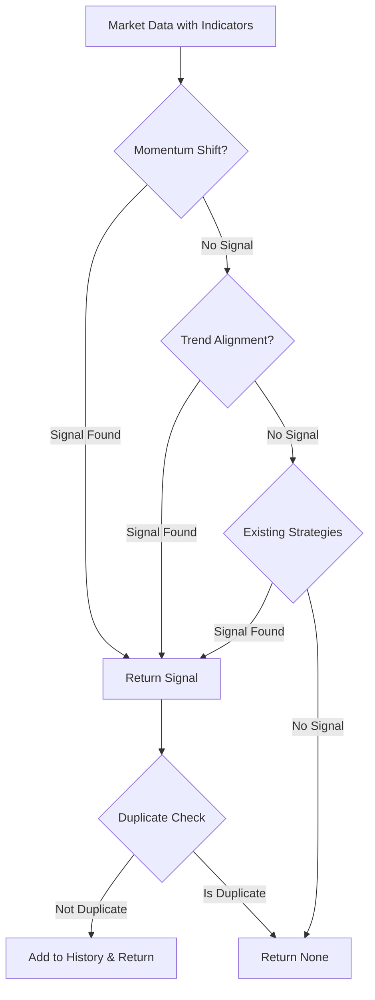

# Design Document

## Overview

This design adapts the successful multi-strategy approach from the Gold scanner to improve signal detection for BTC/USD and US30. The Gold scanner generates good signals because it uses multiple specialized strategies evaluated in priority order, while BTC and US30 currently rely on more restrictive single-strategy approaches.

The solution adds four new strategies to both BTC and US30 scanners:
1. **Momentum Shift** - Detects RSI turning points with ADX and volume confirmation
2. **Trend Alignment** - Identifies cascade EMA alignment with RSI directional confirmation
3. **EMA Cloud Breakout** - Range breakouts with EMA alignment and VWAP confirmation
4. **Mean Reversion** - Reversal signals when price overextended from VWAP

These strategies will be evaluated before existing strategies, providing more opportunities to detect valid signals while maintaining quality through strict confirmation requirements.

**Note:** Asian Range Breakout is Gold-specific (requires session tracking) and won't be added to BTC/US30.

## Architecture

### Component Overview

```
┌─────────────────────────────────────────────────────────────┐
│                    Scanner Main Loop                         │
│                  (main.py / main_swing.py)                  │
└────────────────────────┬────────────────────────────────────┘
                         │
                         ▼
┌─────────────────────────────────────────────────────────────┐
│                  Signal Detector                             │
│  ┌──────────────────────────────────────────────────────┐  │
│  │  detect_signals(data, timeframe, symbol)             │  │
│  │                                                        │  │
│  │  Priority Order:                                      │  │
│  │  1. _detect_momentum_shift()        [NEW]            │  │
│  │  2. _detect_trend_alignment()       [NEW]            │  │
│  │  3. _detect_ema_cloud_breakout()    [NEW]            │  │
│  │  4. _detect_mean_reversion()        [NEW]            │  │
│  │  5. _check_bullish_confluence()     [EXISTING]       │  │
│  │  6. _check_bearish_confluence()     [EXISTING]       │  │
│  │  7. _detect_trend_following()       [EXISTING]       │  │
│  └──────────────────────────────────────────────────────┘  │
└─────────────────────────────────────────────────────────────┘
```

### Strategy Evaluation Flow



## Components and Interfaces

### 1. BTC Signal Detector Enhancement (src/signal_detector.py)

#### New Methods

**_detect_momentum_shift()**
```python
def _detect_momentum_shift(self, data: pd.DataFrame, timeframe: str, symbol: str) -> Optional[Signal]:
    """
    Detect momentum shift signals for BTC.
    
    Logic:
    - Check RSI(14) increasing over 3 candles (bullish) or decreasing (bearish)
    - Verify ADX >= 18 (trend forming)
    - Confirm volume >= 1.2x average
    - Validate trend context (price vs EMA50)
    - Check recent price action (10 candles) aligns with signal direction
    
    Returns:
        Signal with 2.0 ATR stop loss, 3.0 ATR take profit
    """
```

**_detect_trend_alignment()**
```python
def _detect_trend_alignment(self, data: pd.DataFrame, timeframe: str, symbol: str) -> Optional[Signal]:
    """
    Detect trend alignment signals for BTC.
    
    Logic:
    - Check cascade alignment: Price > EMA9 > EMA21 > EMA50 (bullish)
                              or Price < EMA9 < EMA21 < EMA50 (bearish)
    - Verify RSI > 50 (bullish) or RSI < 50 (bearish)
    - Confirm RSI direction matches signal (rising for LONG, falling for SHORT)
    - Validate ADX >= 19 (strong trend)
    - Check volume >= 0.8x average
    
    Returns:
        Signal with configured ATR multipliers
    """
```

**_detect_ema_cloud_breakout()**
```python
def _detect_ema_cloud_breakout(self, data: pd.DataFrame, timeframe: str, symbol: str) -> Optional[Signal]:
    """
    Detect EMA cloud breakout signals for BTC.
    
    Logic:
    - Check EMA(21) and EMA(50) alignment (bullish: EMA21 > EMA50, bearish: EMA21 < EMA50)
    - Verify price vs VWAP (bullish: price > VWAP, bearish: price < VWAP)
    - Confirm RSI in range 25-75 (avoid extremes)
    - Check volume >= 1.5x average (strong breakout)
    - Detect range breakout (price breaks recent 10-candle high/low)
    
    Returns:
        Signal with 1.2 ATR stop loss, 1.5 ATR take profit
    """
```

**_detect_mean_reversion()**
```python
def _detect_mean_reversion(self, data: pd.DataFrame, timeframe: str, symbol: str) -> Optional[Signal]:
    """
    Detect mean reversion signals for BTC.
    
    Logic:
    - Check price overextension (> 1.5 ATR from VWAP)
    - Verify RSI extremes (< 25 oversold or > 75 overbought)
    - Detect reversal candle patterns (pin bar, doji, engulfing)
    - Confirm volume >= 1.3x average
    - Target VWAP for mean reversion
    
    Returns:
        Signal with 1.0 ATR stop loss, VWAP as take profit
    """
```

#### Modified Methods

**detect_signals()**
```python
def detect_signals(self, data: pd.DataFrame, timeframe: str, symbol: str = "BTC/USD") -> Optional[Signal]:
    """
    Enhanced detection with priority order:
    1. Momentum shift (NEW)
    2. Trend alignment (NEW)
    3. EMA cloud breakout (NEW)
    4. Mean reversion (NEW)
    5. Bullish confluence (EXISTING)
    6. Bearish confluence (EXISTING)
    7. Trend following (EXISTING)
    8. Extreme RSI reversal (EXISTING, if enabled)
    9. H4 HVG (EXISTING, 4h timeframe only)
    """
```

### 2. US30 Swing Detector Enhancement (us30_scanner/us30_swing_detector.py)

#### Modified Methods

**_detect_momentum_shift()**
```python
def _detect_momentum_shift(self, data: pd.DataFrame, timeframe: str, symbol: str = "US30") -> Optional[US30SwingSignal]:
    """
    Enhanced momentum shift detection for US30.
    
    Changes from existing implementation:
    - Use RSI(14) instead of RSI(7) for more stable signals
    - Increase ADX threshold to 22 (from 18) for stronger trend confirmation
    - Add RSI momentum threshold check (3.0 points change minimum)
    - Add optional price confirmation (break above/below previous high/low)
    - Improve logging for debugging
    
    Logic:
    - Check RSI(14) increasing/decreasing over 3 candles
    - Verify ADX >= 22
    - Confirm volume >= 0.8x average
    - Validate RSI momentum threshold (configurable, default 3.0)
    - Optional: Require price confirmation
    """
```

**_detect_trend_alignment()**
```python
def _detect_trend_alignment(self, data: pd.DataFrame, timeframe: str, symbol: str = "US30") -> Optional[US30SwingSignal]:
    """
    Enhanced trend alignment detection for US30.
    
    Changes from existing implementation:
    - Add comprehensive logging of EMA cascade status
    - Add RSI direction check (rising for bullish, falling for bearish)
    - Log specific failure reasons when conditions not met
    - Use ADX >= 19 threshold
    - Use volume >= 0.8x threshold
    
    Logic:
    - Check cascade alignment (Price > EMA9 > EMA21 > EMA50)
    - Verify RSI > 50 (bullish) or < 50 (bearish)
    - Confirm RSI direction matches signal
    - Validate ADX >= 19
    - Check volume >= 0.8x average
    """
```

**detect_signals()**
```python
def detect_signals(self, data: pd.DataFrame, timeframe: str, symbol: str = "US30") -> Optional[US30SwingSignal]:
    """
    Enhanced detection with priority order:
    1. H4 HVG (4h timeframe only) (EXISTING)
    2. Momentum shift (ENHANCED)
    3. Trend alignment (ENHANCED)
    4. EMA cloud breakout (NEW)
    5. Mean reversion (NEW)
    6. Trend continuation (EXISTING)
    7. Trend reversal (EXISTING)
    """
```

#### New Methods for US30

**_detect_ema_cloud_breakout()**
```python
def _detect_ema_cloud_breakout(self, data: pd.DataFrame, timeframe: str, symbol: str = "US30") -> Optional[US30SwingSignal]:
    """
    Detect EMA cloud breakout signals for US30.
    
    Logic:
    - Check EMA(21) and EMA(50) alignment
    - Verify price vs VWAP
    - Confirm RSI in range 25-75
    - Check volume >= 1.5x average
    - Detect range breakout (10-candle high/low)
    
    Returns:
        US30SwingSignal with 1.2 ATR stop loss, 1.5 ATR take profit
    """
```

**_detect_mean_reversion()**
```python
def _detect_mean_reversion(self, data: pd.DataFrame, timeframe: str, symbol: str = "US30") -> Optional[US30SwingSignal]:
    """
    Detect mean reversion signals for US30.
    
    Logic:
    - Check price overextension (> 1.5 ATR from VWAP)
    - Verify RSI extremes (< 25 or > 75)
    - Detect reversal candle patterns
    - Confirm volume >= 1.3x average
    - Target VWAP for mean reversion
    
    Returns:
        US30SwingSignal with 1.0 ATR stop loss, VWAP as take profit
    """
```

### 3. Candle Pattern Detection Helpers

Both BTC and US30 detectors will need helper methods for mean reversion candle pattern detection:

**_is_pin_bar()**
```python
def _is_pin_bar(self, candle: pd.Series) -> bool:
    """
    Detect pin bar (long wick, small body).
    
    Logic:
    - Calculate body size and wick sizes
    - Pin bar has wick at least 2x body size
    - Body should be in upper/lower 1/3 of candle
    """
```

**_is_doji()**
```python
def _is_doji(self, candle: pd.Series) -> bool:
    """
    Detect doji (very small body).
    
    Logic:
    - Body size < 10% of total candle range
    """
```

**_is_engulfing()**
```python
def _is_engulfing(self, current: pd.Series, previous: pd.Series) -> bool:
    """
    Detect engulfing candle.
    
    Logic:
    - Bullish: Current green candle body engulfs previous red candle body
    - Bearish: Current red candle body engulfs previous green candle body
    """
```

### 4. Configuration Updates

#### BTC Config (config/config.json)

Add new signal rules:
```json
{
  "signal_rules": {
    "volume_spike_threshold": 0.8,
    "volume_momentum_shift": 1.2,
    "volume_trend_alignment": 0.8,
    "rsi_momentum_threshold": 3.0,
    "adx_min_momentum_shift": 18,
    "adx_min_trend_alignment": 19,
    "stop_loss_atr_multiplier": 1.5,
    "take_profit_atr_multiplier": 1.0,
    "momentum_shift_sl_multiplier": 2.0,
    "momentum_shift_tp_multiplier": 3.0
  }
}
```

#### US30 Config (us30_scanner/config_us30_swing.json)

Update existing signal rules:
```json
{
  "signal_rules": {
    "volume_spike_threshold": 0.8,
    "rsi_momentum_threshold": 3.0,
    "adx_min_momentum_shift": 22,
    "adx_min_trend_alignment": 19,
    "require_price_confirmation": false
  }
}
```

## Data Models

### Signal Detection Context

```python
@dataclass
class MomentumShiftContext:
    """Context for momentum shift detection"""
    rsi_values: List[float]  # Last 3 RSI values
    rsi_change: float  # Total RSI change over period
    adx: float
    volume_ratio: float
    price_vs_ema50: str  # "above" or "below"
    recent_price_trend: str  # "rising" or "falling"
    
@dataclass
class TrendAlignmentContext:
    """Context for trend alignment detection"""
    cascade_type: str  # "bullish", "bearish", or "none"
    ema_values: Dict[str, float]  # EMA 9, 21, 50
    rsi: float
    rsi_direction: str  # "rising" or "falling"
    adx: float
    volume_ratio: float
```

### Enhanced Signal Object

No changes to Signal dataclass structure. Strategy name will be set in the `strategy` field:
- "Momentum Shift (Bullish)" / "Momentum Shift (Bearish)"
- "Trend Alignment (Bullish)" / "Trend Alignment (Bearish)"

## Error Handling

### Missing Indicators

```python
def _detect_momentum_shift(self, data: pd.DataFrame, timeframe: str, symbol: str) -> Optional[Signal]:
    # Check for required indicators
    required_indicators = ['rsi', 'adx', 'volume', 'volume_ma', 'atr', 'ema_50']
    if not all(ind in data.iloc[-1].index for ind in required_indicators):
        logger.debug(f"[{timeframe}] Missing required indicators for momentum shift detection")
        return None
```

### Insufficient Data

```python
def _detect_momentum_shift(self, data: pd.DataFrame, timeframe: str, symbol: str) -> Optional[Signal]:
    if len(data) < 10:  # Need at least 10 candles for recent price trend check
        logger.debug(f"[{timeframe}] Insufficient data for momentum shift: {len(data)} candles")
        return None
```

### NaN Values

```python
def _detect_trend_alignment(self, data: pd.DataFrame, timeframe: str, symbol: str) -> Optional[Signal]:
    last = data.iloc[-1]
    
    # Check for NaN in critical indicators
    if pd.isna(last['ema_9']) or pd.isna(last['ema_21']) or pd.isna(last['ema_50']):
        logger.warning(f"[{timeframe}] NaN values in EMA indicators, skipping trend alignment")
        return None
```

### Exception Handling

```python
def _detect_momentum_shift(self, data: pd.DataFrame, timeframe: str, symbol: str) -> Optional[Signal]:
    try:
        # Detection logic
        ...
    except KeyError as e:
        logger.error(f"Missing indicator in momentum shift detection: {e}")
        return None
    except Exception as e:
        logger.error(f"Error in momentum shift detection: {e}", exc_info=True)
        return None
```

## Testing Strategy

### Unit Tests

**test_momentum_shift_detection.py**
```python
def test_bullish_momentum_shift_btc():
    """Test bullish momentum shift detection for BTC"""
    # Setup: RSI increasing, ADX > 18, volume > 1.2x, price > EMA50
    # Assert: LONG signal generated with correct SL/TP
    
def test_bearish_momentum_shift_btc():
    """Test bearish momentum shift detection for BTC"""
    # Setup: RSI decreasing, ADX > 18, volume > 1.2x, price < EMA50
    # Assert: SHORT signal generated with correct SL/TP
    
def test_momentum_shift_rejects_low_adx():
    """Test momentum shift rejection when ADX too low"""
    # Setup: RSI turning but ADX < 18
    # Assert: No signal generated
    
def test_momentum_shift_rejects_wrong_trend_context():
    """Test momentum shift rejection when trend context wrong"""
    # Setup: Bullish RSI turn but price < EMA50
    # Assert: No signal generated
```

**test_trend_alignment_detection.py**
```python
def test_bullish_trend_alignment_btc():
    """Test bullish trend alignment detection for BTC"""
    # Setup: Price > EMA9 > EMA21 > EMA50, RSI > 50 rising, ADX > 19
    # Assert: LONG signal generated
    
def test_bearish_trend_alignment_btc():
    """Test bearish trend alignment detection for BTC"""
    # Setup: Price < EMA9 < EMA21 < EMA50, RSI < 50 falling, ADX > 19
    # Assert: SHORT signal generated
    
def test_trend_alignment_rejects_no_cascade():
    """Test trend alignment rejection when EMAs not aligned"""
    # Setup: EMAs not in cascade order
    # Assert: No signal generated
    
def test_trend_alignment_rejects_wrong_rsi_direction():
    """Test trend alignment rejection when RSI direction wrong"""
    # Setup: Bullish cascade but RSI falling
    # Assert: No signal generated
```

**test_us30_momentum_shift.py**
```python
def test_us30_momentum_shift_with_price_confirmation():
    """Test US30 momentum shift with price confirmation enabled"""
    # Setup: RSI turning, ADX > 22, price breaks previous high
    # Assert: Signal generated
    
def test_us30_momentum_shift_without_price_confirmation():
    """Test US30 momentum shift without price confirmation"""
    # Setup: RSI turning, ADX > 22, no price break
    # Assert: Signal generated (confirmation disabled)
    
def test_us30_momentum_shift_rsi_threshold():
    """Test US30 momentum shift RSI threshold check"""
    # Setup: RSI change < 3.0 points
    # Assert: No signal generated
```

### Integration Tests

**test_btc_signal_priority.py**
```python
def test_momentum_shift_takes_priority_over_confluence():
    """Test that momentum shift is checked before confluence"""
    # Setup: Both momentum shift and confluence conditions met
    # Assert: Momentum shift signal returned
    
def test_trend_alignment_takes_priority_over_trend_following():
    """Test that trend alignment is checked before trend following"""
    # Setup: Both trend alignment and trend following conditions met
    # Assert: Trend alignment signal returned
```

**test_us30_signal_priority.py**
```python
def test_us30_strategy_priority_order():
    """Test US30 strategy evaluation order"""
    # Setup: Multiple strategies have valid conditions
    # Assert: Highest priority strategy signal returned
```

### Live Data Tests

**test_btc_live_momentum_shift.py**
```python
def test_btc_momentum_shift_with_live_data():
    """Test BTC momentum shift with live market data"""
    # Fetch live BTC data
    # Run momentum shift detection
    # Log results for manual verification
```

**test_us30_live_trend_alignment.py**
```python
def test_us30_trend_alignment_with_live_data():
    """Test US30 trend alignment with live market data"""
    # Fetch live US30 data
    # Run trend alignment detection
    # Log results for manual verification
```

## Logging Strategy

### Momentum Shift Logging

```python
# When checking momentum shift
logger.debug(f"[{timeframe}] Checking momentum shift: RSI {rsi_prev2:.1f} -> {rsi_prev:.1f} -> {rsi_current:.1f}")

# When ADX too low
logger.debug(f"[{timeframe}] ADX too low: {adx:.1f} (need >= {threshold} for momentum shift)")

# When volume too low
logger.debug(f"[{timeframe}] Volume too low: {volume_ratio:.2f}x (need >= {threshold}x)")

# When trend context wrong
logger.debug(f"[{timeframe}] Bullish RSI turn rejected - price below EMA(50): ${price:.2f} < ${ema50:.2f}")

# When signal generated
logger.info(f"[{timeframe}] Bullish momentum shift detected - RSI: {rsi_prev2:.1f} -> {rsi_prev:.1f} -> {rsi_current:.1f}")
logger.info(f"[{timeframe}] Trend confirmed: Price ${price:.2f} > EMA(50) ${ema50:.2f}")
logger.info(f"[{timeframe}] ADX: {adx:.1f}, Volume: {volume_ratio:.2f}x")
```

### Trend Alignment Logging

```python
# When checking cascade
logger.debug(f"[{timeframe}] Checking cascade: Price={price:.2f}, EMA9={ema9:.2f}, EMA21={ema21:.2f}, EMA50={ema50:.2f}")

# When cascade detected
logger.info(f"[{timeframe}] Bullish cascade detected: Price > EMA9 > EMA21 > EMA50")

# When RSI wrong
logger.debug(f"[{timeframe}] Bullish cascade but RSI too low: {rsi:.1f} (need > 50)")

# When RSI direction wrong
logger.debug(f"[{timeframe}] Bullish cascade but RSI not rising: {rsi_prev:.1f} -> {rsi_current:.1f}")

# When signal generated
logger.info(f"[{timeframe}] Bullish trend alignment conditions met - RSI: {rsi:.1f} (rising), ADX: {adx:.1f}, Volume: {volume_ratio:.2f}x")
```

### Strategy Priority Logging

```python
# In detect_signals()
logger.debug(f"[{timeframe}] Evaluating strategies in priority order")

# After each strategy check
if signal:
    logger.info(f"[{timeframe}] {signal.strategy} signal found, stopping evaluation")
else:
    logger.debug(f"[{timeframe}] No signal from {strategy_name}, trying next strategy")
```

## Performance Considerations

### Computational Efficiency

1. **Early Returns**: Each strategy returns immediately if conditions not met
2. **Indicator Reuse**: All strategies use same calculated indicators (no recalculation)
3. **Priority Order**: Most likely strategies checked first to minimize unnecessary checks

### Memory Usage

1. **Signal History**: Limited to 50 recent signals via deque
2. **Data Buffer**: No additional data buffering beyond existing implementation
3. **Context Objects**: Created only when needed, not stored

### API Rate Limits

No impact - strategies use existing data fetching mechanisms

## Deployment Considerations

### Configuration Migration

1. Add new config parameters to existing config files
2. Use defaults if parameters not present (backward compatible)
3. No breaking changes to existing config structure

### Rollback Plan

1. New strategies are additive (don't modify existing logic)
2. Can disable new strategies by commenting out calls in detect_signals()
3. Existing strategies remain unchanged as fallback

### Monitoring

1. Log strategy usage statistics (which strategies generate signals)
2. Track signal quality metrics (win rate per strategy)
3. Monitor duplicate signal rates
4. Alert on missing indicators or errors

## Security Considerations

No security implications - changes are purely algorithmic within existing security boundaries.

## Scalability

The design scales well:
1. Additional strategies can be added following same pattern
2. Strategy priority can be easily reordered
3. Per-asset strategy configuration supported
4. No architectural changes needed for additional assets
